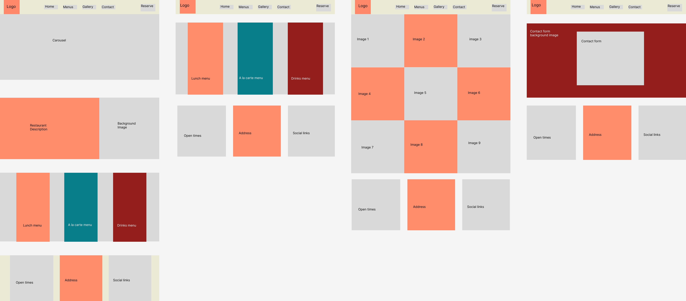

# Manzuko Sushi Restaurant 

## Contents

* [Project Description](#project-description)
* [User Experience](#user-experience)
* [Creation Process](#creation-process)
* [Design](#design)
    * [Logo](#logo)
    * [Colour Scheme](#colour-scheme)
    * [Typography](#typography)
    * [Imagery](#imagery)
* [Tablet and mobile view](#tablet-and-mobile-view)
    * [Desktop, tablet and mobile differences](#desktop,-tablet-and-mobile-differences)
    * [Tablet view](#tablet-view)
    * [Mobile view](#mobile-view)
* [Future Features](#future-features)
* [Technologies used](#technologies-used)  
    * [Languages used](#languages-used)
    * [Frameworks, libraries & programs used](#frameworks,-libraries-&-programs-used)
* [Deployment](#deployment)
* [Testing](#testing) 

# Project Description
In this project the aim was to present and market the imagined sushi restaurant, Manzuko. With the aim
of converting website viewers into restarant customers a large importance was placed on appealing imagry
and appropriate styling. 
The website presents multiple oportunities for customer engagement with reservation
and comment tables in place. The nessersary information such as location, menus, restaurant
description and links to social media are provided. However, the customer isn't floaded with information, instead
attractive and inticing imagry is showcased drawing the customer in and encouraging further exploration.

# User Experience (UX)
## Primary Goal
The goal of the Manzuko website is to create a pleasant and engaging site that demonstrates the strong asthetic nature
of the restuarant and products it produces. 

## Visitor Goals
Visitors to Manzuko tend to have an age of 25+ as the restraunt offers a high quality experience and customers pay a premium
for this. These users expect a professional, easy to use and intuitative user experience. Navigation, buttons and layout perform 
according to convention and these customers would be comfortable navigating the site on their first visit. The website will function
responsively as users will likey use a variety of devices when choosing a restaurant.

## First time visitor
* Users can easily access all pages through navigation bar.
* Menu items are immediately showcased in the crousel, encouraging further exploration. 
* Users are immediately able to make a reservation, saving them looking to find that function.
* Users are presented with vital information such as address and opening times in the footer element.

## Returning visitor
* A returning customer can quickly access menus and reservation booking to plan their visit.
* Returning customer's can easily access social media links inorder to engage with the community
and learn about upcoming events.
* The contact page enables returning customers to leave a comment and know that their opinions matter.

# Creation Process
## Strategy

## Scope
## Structure
## Skeleton
## Wireframe 
The planning stage of this project included creating a wireframe in Figma. This allowed the number of pages, content required and 
layout to be determined before coding began.

# Design

## Colour Scheme
To generate the palette for the Manzuko project the website https://coolors.co was used. The palette began with the selection of 
coral for use with the logo and as the main colour theme of the website. Coral matched with the seafood theme of the website and it's
sutle nature matched with the desired direction for the website. The palette generator in https://coolors.co helped to adds colors to 
the palette that contrasted with coral but wouldn't clash. White was also used through the site inorder to create place between the many images used.

## Logo
The logo for this project was created on https://www.wix.com/logo/maker. The primary color chosen for the website was coral and this contrast nicely with eggshell, so these were the colours used for the logo design. The design was intented to be minimal to high light the sutle minimalist style of the design. With this in mind simply the Japanese text 満足 Manzuko, was chosen. This translates to satisfaction in English which worked well for the design.

## Typography
The fronts for this project were taken from https://www.cdnfonts.com/ . 
 * Shameimaru-sans was chosen for all headers in the project for its elegant and minimalist look. This suited the sutle and elegant     design for the project.
 
 * Montserrat was chosen for the paragaph elements as it contrasted well with Shameimaru-sans and remained easily readable at smaller
 sizes.
 
 
## Imagery 
All images were taken from https://stock.adobe.com/uk/. These are all free licenced materials.

 

# Existing Features

## Navigation Bar
The navigation bar is fully reponsive, it provides links to all 4 pages of the website. Included is also a reservation
button that opens a modal and the restaurant logo which acts as a link back to the home page. The nav bar remains fixed
to the top of the page when scrolling to allow easy navigation at all times.

## Carousel
Covering the the whole of the view window below the nav bar on the home page is the carousel feature. The carousel showcases 3 images of sushi. The carousel is set to auto-play and includes 3 styled indicators at the bottom.

## Restaurant description section
The restaurant description section contains 2 divs, 1 spanning 2/3 of the page and the other spanning the remaining 1/3.
These divs contain attractive backgrounds. In the larger div is placed a card which describes the restaurant and the atmosphere it seeks to create. On mobile devices the second div is removed to improve spacing on the smaller screen.

## Reservation booking
In the nav bar and within the restaurant description section is a button which opens a model with the nessasary input for a customer to book a table.

## Menu links
On the home page and on the menu page are 3 cards showcasing the 3 menus, lunch, a la carte and drinks. These include a 
promt and anchor link to the full pdf menus which open in a seperate window.

## Gallery
The gallery page showcases images from within the restaurant, showing the dinning experience and setting.

## Contact form
The contact page includes a contact form which allows the customer to leave a comment and provide the restarant with
their email and phone number. 

## Footer section
The foot section displayed on all pages provides essential information to the customer. This includes opening times, location and links to social media. These links open in a seperate page.

# Tablet and mobile view

## Desktop, tablet and mobile differences

## Tablet view

## Mobile view

# Future features

# Technologies used

## Languages used

## Frameworks, libraries & programs used

# Deployment

# Testing
Using the lighthouse testing facilty on Google Chrome highlighted a number of issues. 

## 1. Performance
* Performance was very poor. Pages took too long to load because of the size of the .png files.

    Solution; The large image files .png (10Mb~) where converted to .avif files. These generated a roughly
    90% reduction in files sizes and greatly improved performance.  

## 2. Accessabilty
* Accessability score was poor. Aria labels were missing from several elements and some aria labels weren't
unique.

    Solution; Unique aria labels were added to all elements missing them. Alt tags were also added to images.

## 3. Best Practices
* Initially best practices scored 100% so no changes were necessary.

## 4. Search engine optimization
* Search engine opimization scored poorly. 

    Solution; Meta description tag was added to give more information about the site upon a search. This brought
    the SEO score up to 100%. 

After several lighthouse tests and improvements the final scores are shown below.

## HTML Validator

To test html code the html validator https://validator.w3.org/. All HTML pages were tested and improved until the validator 
returned 0 errors.

## CSS Validator

To test html code the html validator https://validator.w3.org/. The CSS page was tested improved until the validator 
returned 0 errors.

